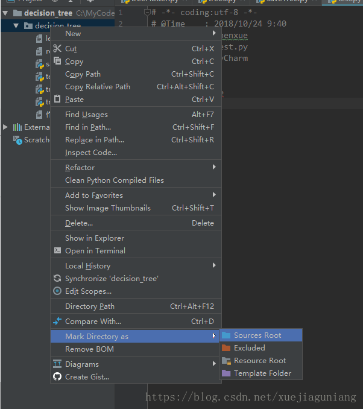

# pp-tracking-demo

可参照[pp-tracking](https://github.com/PaddlePaddle/PaddleDetection/blob/release/2.3/deploy/pptracking/README_cn.md) 理解项目.

> PaddleDetection使用版本release-2.3.0
>> deploy包直接从PaddleDetection项目copy过来使用
>> deploy/pptracking/python/mot_jde_infer.py 文件做过修改，替换包时请注意该文件的变动

```angular2html
 # 增加钩子，用于实时输出识别数据进行业务判断
out_data = backend.service.output_hook.OutputData()
out_data.id_set = online_ids[0]
out_data.frame_id = frame_id
out_data.save_dir = os.path.join(save_dir, '{:05d}.jpg'.format(frame_id))
out_data.frame_count = frame_count
backend.service.output_hook.hook.handle_notice(out_data)
```

```angular2html
sys.path.append(os.path.dirname(os.path.realpath(__file__)))
```

#### 注:

1. Windows环境下，需要手动下载安装[cython_bbox](https://pypi.org/search/?q=cython_bbox) ，然后将setup.py中的找到steup.py,
   修改extra_compile_args=[’-Wno-cpp’]，替换为extra_compile_args = {'gcc': ['/Qstd=c99']}, 然后运行
    ```
    python setup.py build_ext install
    ```
2. 在deploy包内可能会出现No module named xxx的错误。

   将鼠标放在当前文件夹上，点击右键，找到Mark Directory as，再选择Sources Root点击。

   

3. 下载对应模型，将其copy到output_inference目录下。

4. 需要安装ffmpeg,并设置环境变量。

## web服务说明

> 当前websocket没有区分哪个链接，故消息是全部通知。
>
> 因此，没办法同时多开页面进行查看。确认同一时间只有一个web页面再使用识别服务。

## 安装说明

### 服务器部署

1. 安装python3.7  
   推荐使用miniconda

2. 安装依赖包

``` shell script
pip install -r requirements.txt
```  

### 运行

项目默认运行在8092端口：

``` shell script
python backend/main.py [--port=8092]
# --port 指定运行时端口号 默认是8092
```

看到以下输出则代表安装成功：

```shell script
Server is running: http://192.168.0.18:8092
```   

### Docker部署  
使用 Dockerfile 构建 或者直接 Pull镜像  
```shell script
# dockerfile 构建
docker build -t pp-tracking-demo:latest .

# 运行镜像
docker run -itd --rm -p 8092:8092 --name pp-tracking-demo pp-tracking-demo:latest 
```  

```shell script
# 从 dockerhub pull
docker pull litterguy/pp-tracking-demo:latest

# 运行镜像
docker run -itd --rm -p 8092:8092 --name pp-tracking-demo litterguy/pp-tracking-demo:latest 
```  
这里把容器的8091端口映射到了物理机的8092上，但如果你不喜欢映射，去掉run后面的`-p 8092:8092` 也可以使用docker的IP加`8092`来访问  
